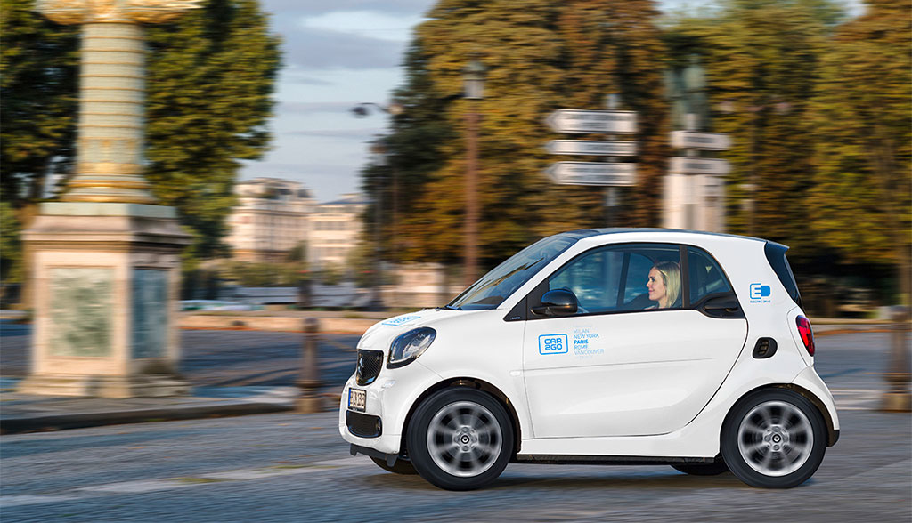

# JavaScript Modul 3 Zugriff auf das DOM

```
let elem = document.getElementById('content');
2 console.log(elem.parentNode)
3 console.log(elem.childNodes)
4 console.log(elem.previousSibling)
5 console.log(elem.nextSibling)
```

(k) Was gibt der obige Sourceode aus? Wie kannst du über  diese Knotenbeziehungen ausgehend vom lipsum-Element auf den Button am  Ende zugreifen?

​	A: Das parentNode = "body", childNode="lipsum, note, note", previousSibling ="meta" und 		    			  	     nextSibling="footer,meta"


```javascript
let footer = document.getElementById('footer');

function doSomething() {
	 footer.innerHTML = event.clientX + " / " + event.clientY;
}

let lipsum = document.getElementById('lipsum');
lipsum.addEventListener('mousemove',doSomething);
```


(l) Was bewirkt der obige Sourcecode? Ändere ihn so ab, dass
der Footer zusätzlich immer seine Farbe ändert, wenn der
Mauszeiger sich über das lipsum-Element bewegt (mouseover).

A: Wenn man in der Lipsum section mit dem Mauszeiger herumspielt, werden die jeweiligen Koordinaten des Mauszeigers angezeigt.

```javascript
	    function red() {
               return "#ff0000"
            }
            function yellow(){
               return "#ffff00"
            }


            
            let footer = document.getElementById('footer');
            function changeColor(){
                footer.style.backgroundColor = red();
            }
            function changeColor2(){
               footer.style.backgroundColor = yellow();
            }
         
           
            
            function doSomething() {
                footer.innerHTML = event.clientX + " / " + event.clientY;
            }

            let lipsum = document.getElementById('lipsum');
            lipsum.addEventListener('mousemove',doSomething);
            lipsum.addEventListener('mouseover', changeColor);
            lipsum.addEventListener('mouseout',changeColor2);
```
(e) Code:
```html
<html>
    <head>
        <title>Dejan Rajic</title>
    </head>
    <body>
        
        <script>
            let img = document.getElementById('bild');

            function moveImg() {
                img.style.marginLeft = event.clientX + 'px';
                img.style.marginTop = event.clientY + 'px';
            }

            document.body.addEventListener('mousemove', moveImg);
        </script>
    </body>
</html>
```
